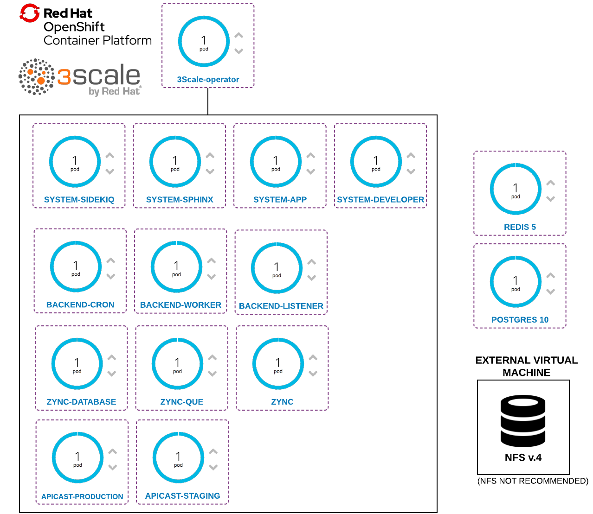
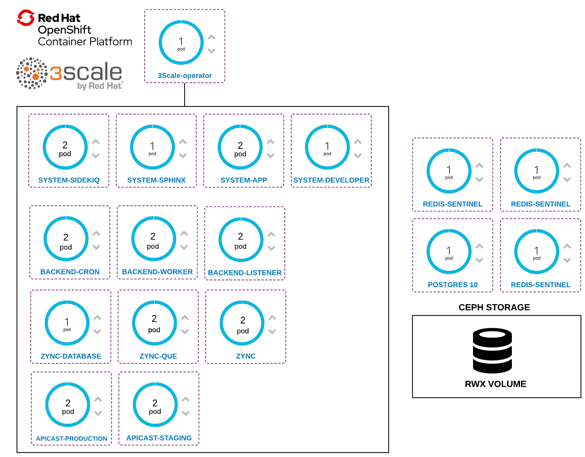
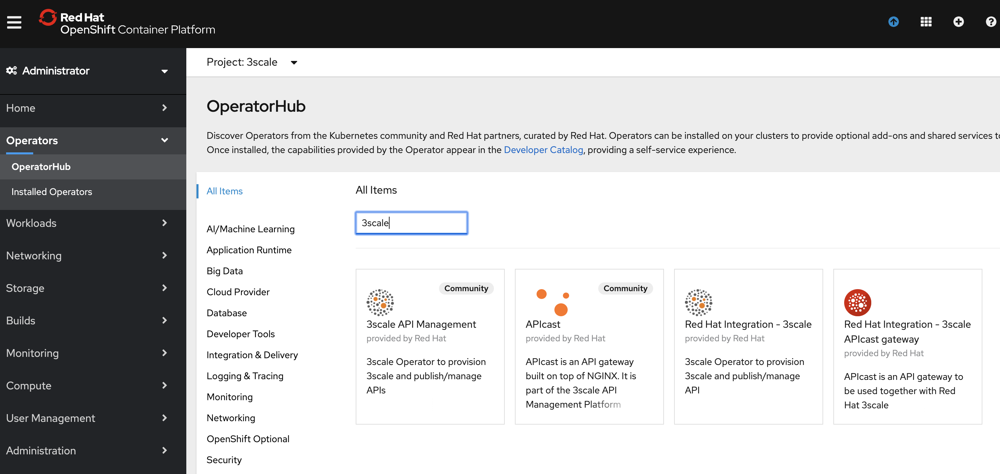
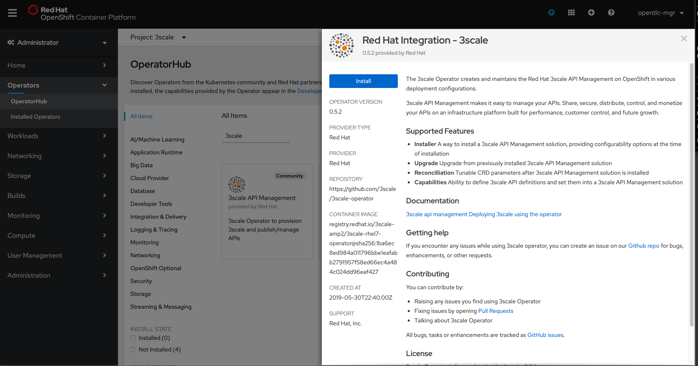
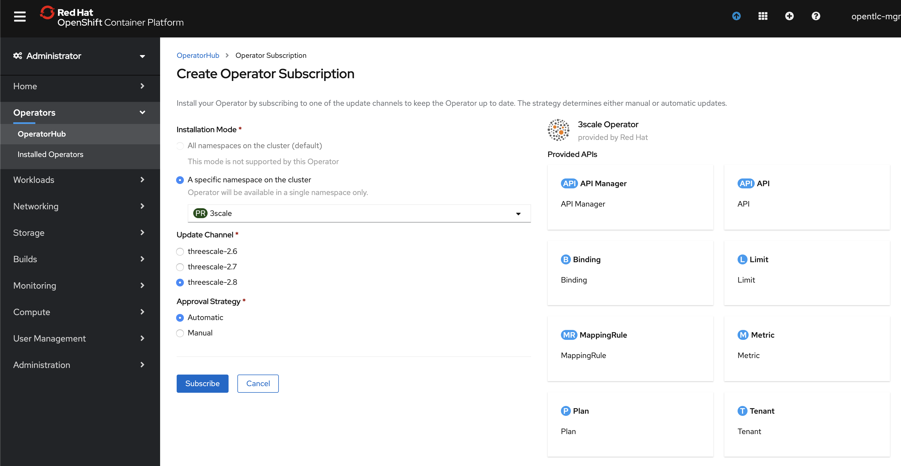
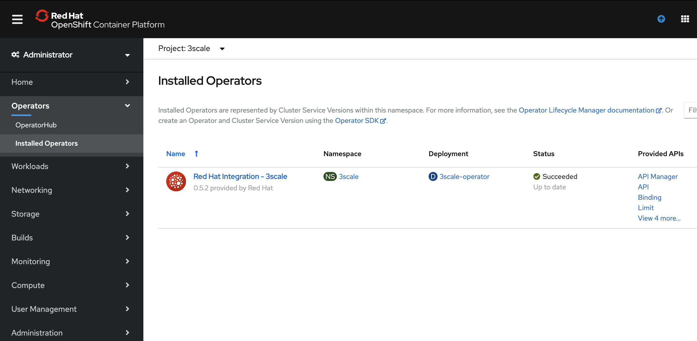

# 3Scale Install with Operator

This guide looks to explore how to perform a 3scale installation in an Openshift 4 cluster using 
the 3Scale Operator.

In this scenario, I'll be using Postgres database outside OCP and Redis inside Openshift but out of the 
Operator management. 

== Staging architecture

== Production Architecture

== Components version

* Openshift 4.2
* 3Scale 2.8
* Redis 5
* Postgres 10

== Install 

. Create a project
. Install the 3Scale Operator using the OLM

. Run the install script: 

    ./install.sh 

The install uses these 03 yml files listed here, that you have to adjust as needed:

Create all the secrets to connect to the databases of the customer

* link:01-secrets.yml[01-secrets.yml]

Create the PersistenceVolume with a storageClass pointed to it. The storageClass 
is necessary because if there is already a storageClass selected as default you will 
not be able to not use none storageClass, so it's necessary to create a specific one.

* link:02-3scale-storage.yml[02-3scale-storage.yml]
* link:02-redis-storage.yml[02-redis-storage.yml]
* link:02-postgres-storage.yml[02-postgres-storage.yml]

Below is a CR template used to deploy the API Management in a staging environment.

* link:03-apimanager-stag.yml[02-apimanager-stag.yml]

For the production environment.

* link:03-apimanager-prod.yml[02-apimanager-prod.yml]

Adjust these files with the correct parameters.

=== Source: 

* https://access.redhat.com/documentation/en-us/red_hat_3scale_api_management/2.8/html-single/installing_3scale/index#installing-threescale-operator-on-openshift[Installing the 3Scale Operator]
* https://access.redhat.com/documentation/en-us/red_hat_3scale_api_management/2.8/html-single/installing_3scale/index#deploying-threescale-using-the-operator[Installing 3Scale using Operator]

== TODO 

* Replace Redis to Redis Sentinel 
* Setup persistence on the Redis database 

== Jiras Related

* https://issues.redhat.com/browse/THREESCALE-5061
* https://issues.redhat.com/browse/THREESCALE-5088
* https://issues.redhat.com/browse/THREESCALE-5087 

