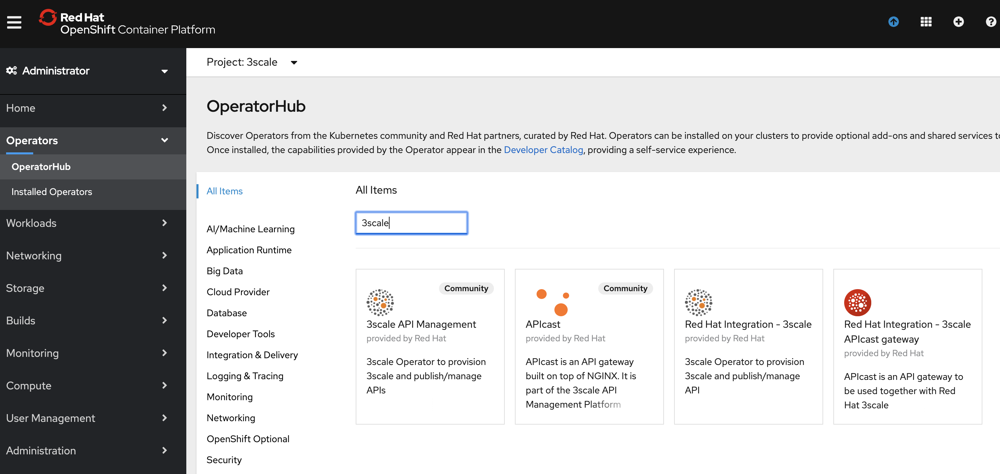
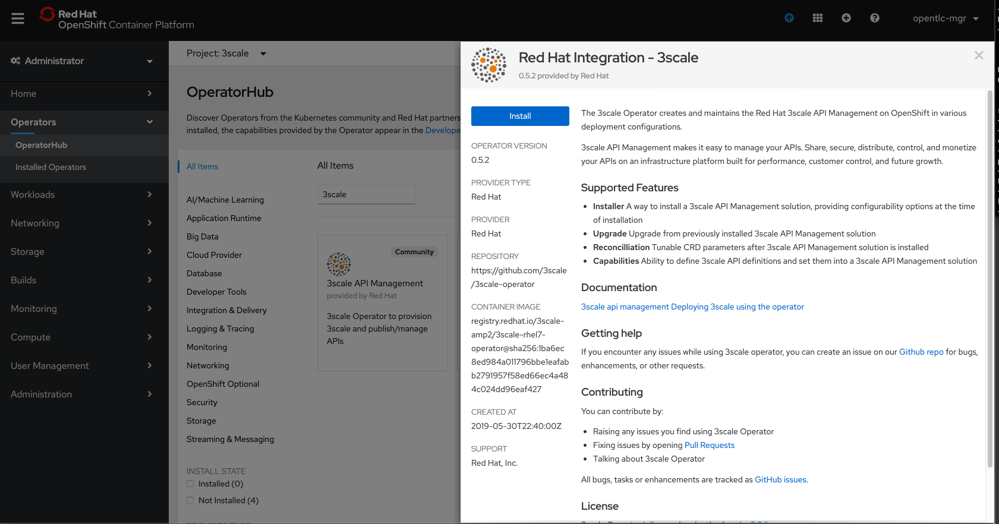
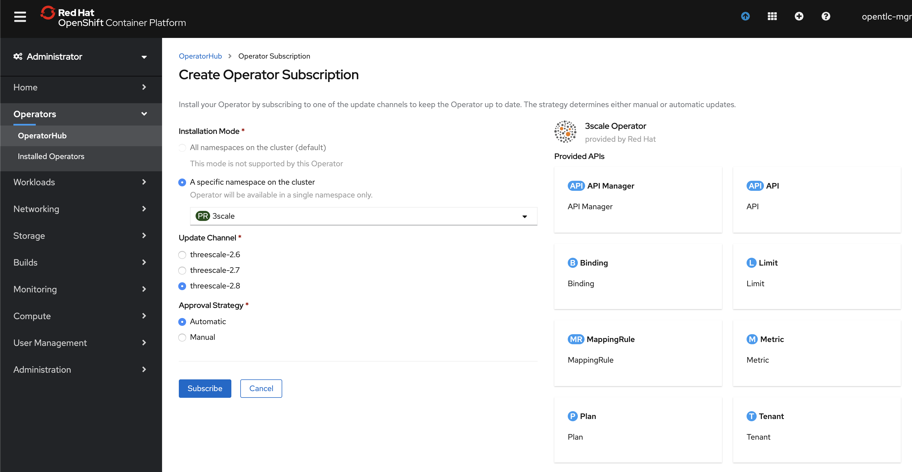
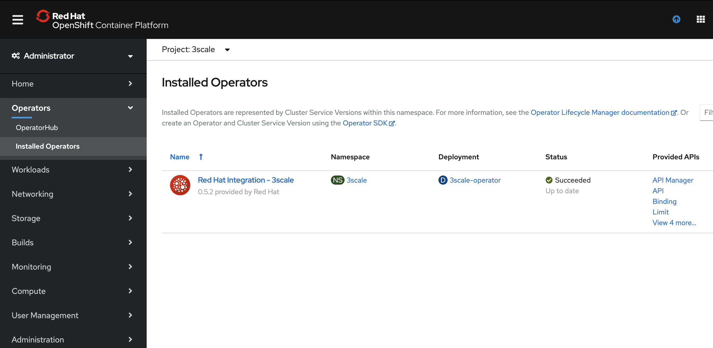
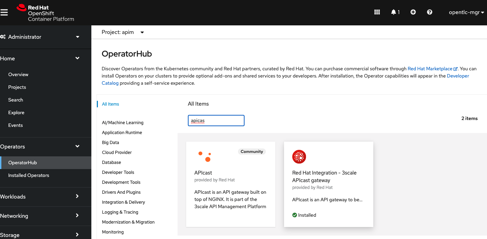
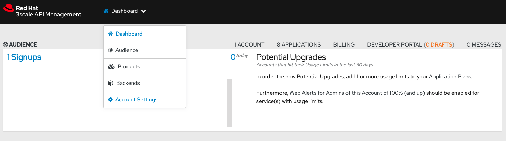
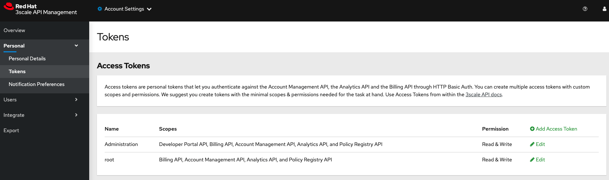
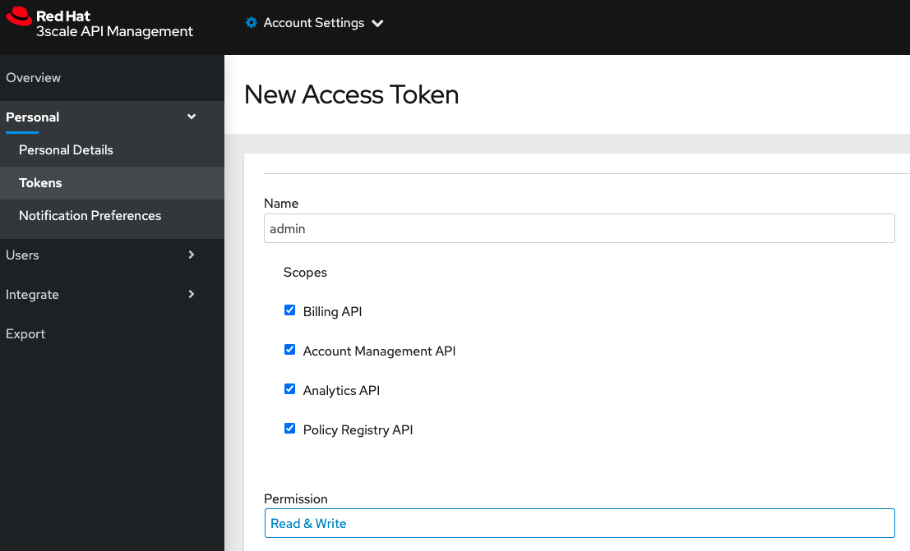
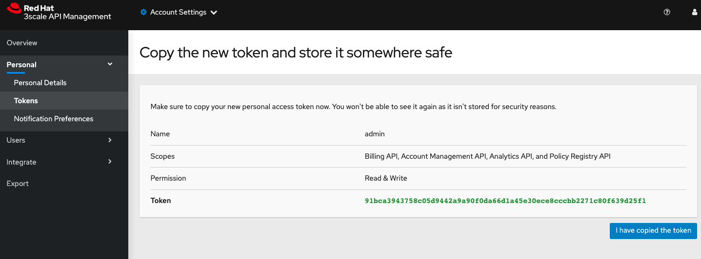

# 3Scale Install with Operator

This guide looks to explore how to perform a 3scale installation in an Openshift 4 cluster using 
the 3Scale Operator.

In this scenario, I'll be using Postgres database outside OCP and Redis inside Openshift but out of the 
Operator management. 

== Install 

. Create a project
. Install the 3Scale Operator using the OLM

. Create the persistence volume (Just in case that you don't have a RWX volume option available)

    oc create -f system-storage.yaml

. Open the `apimanager.yaml` and update the `wildcardDomain`, and create it.

    oc create -f apimanager.yaml

. Create the RHSSO 

    oc new-app --template=sso74-ocp4-x509-postgresql-persistent

=== Creating your first API with 3Scale 

. Create a backend (public-banks)
.. Create the methods
.. Create the mapping rules

. Create a backend (private-banks)
.. Create the methods
.. Create the mapping rules

. Create the product 
.. associate the backends with the product 

. Create an application Plan 
.. Sandbox
... Create a rate limit of 10 request per minute
.. Production 

. Create an application (Audience > Select an Account > Click on the breadcrumb Application > Create Application)
.. Name it as atm-finder (8df307092ac9b717c5328401466d1748)
.. Select the production as the application plan 

. Create another application
.. Name it as wallet (0dc2bd78fb2303e13c094854105b3b51)
.. Select the sandbox as the application plan 

. Promote to staging 

oc set env dc/apicast APICAST_EXTENDED_METRICS=true

3scale backend copy Open_Data_API20 --source=saas --destination=rhpds
3scale application-plan export -f plan-sandbox.yaml saas Open_Data_API20 sandbox
3scale application-plan export -f plan-production.yaml saas Open_Data_API20 production

3scale application-plan import -f plan-sandbox.yaml rhpds open_data
3scale application-plan import -f plan-production.yaml rhpds open_data

== Deploy a a custom APICast

Install the APICast Operator 

Create an admin token (in case you do not have one)

Create the secret in Openshift

    # oc create secret generic ${SOME_SECRET_NAME} --from-literal=AdminPortalURL=${MY_3SCALE_URL}
    oc create secret generic ramalho-gwt-secret --from-literal=AdminPortalURL=https://91bca3943758c05d9442a9a90f0da66d1a45e30ece8cccbb2271c80f639d25f1@3scale-admin.apps.cluster-8d9f.8d9f.sandbox29.opentlc.com

Deploy the gateway

    oc create -f ramalho-gateway.yml

== RHSSO

https://access.redhat.com/documentation/en-us/red_hat_3scale_api_management/2.10/html/administering_the_api_gateway/openid-connect

    echo -n | openssl s_client -connect keycloak-apim.apps.cluster-8d9f.8d9f.sandbox29.opentlc.com:443 -servername https://keycloak-apim.apps.cluster-8d9f.8d9f.sandbox29.opentlc.com -showcerts | sed -ne '/-BEGIN CERTIFICATE-/,/-END CERTIFICATE-/p' > customCA.pem
    curl -v https://keycloak-apim.apps.cluster-8d9f.8d9f.sandbox29.opentlc.com/auth/realms/master --cacert customCA.pem
    oc exec zync-que-1-k7kwl cat /etc/pki/tls/cert.pem > zync.pem
    cat customCA.pem >> zync.pem
    oc create configmap zync-ca-bundle --from-file=./zync.pem
    oc set volume dc/zync-que --add --name=zync-ca-bundle --mount-path /etc/pki/tls/zync/zync.pem --sub-path zync.pem --source='{"configMap":{"name":"zync-ca-bundle","items":[{"key":"zync.pem","path":"zync.pem"}]}}'
    oc exec zync-que-2-dd42b cat /etc/pki/tls/zync/zync.pem
    oc set env dc/zync-que SSL_CERT_FILE=/etc/pki/tls/zync/zync.pem

CientID Credentials

    3scale-admin
    6fcc8e4e-82b2-42cf-8e22-8f39616d1770

User
    
    rramalho@redhat.com
    redhat

