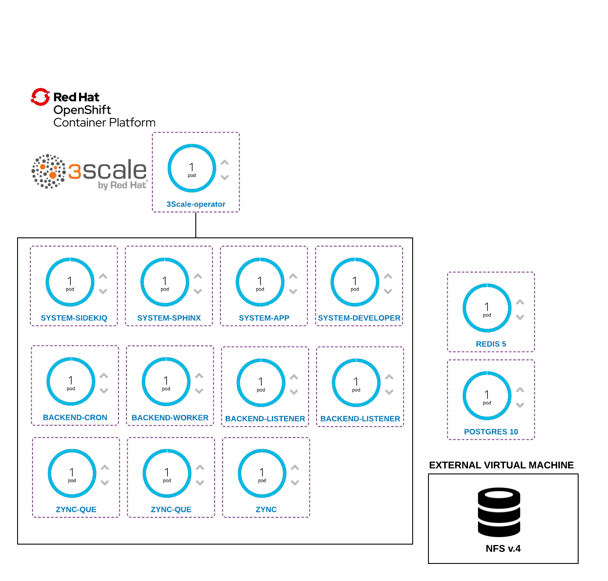

# 3Scale Install with Operator

This guide looks to explore how to perform a 3scale installation in an Openshift 4 cluster using 
the 3Scale Operator.

In this scenario, we are going to deploy both databases: Postgres and Redis outside of the 3scale operator 
domain. So the databases itself isn't managed by the 3Scale Operator.

Diagram of the architecture:

Components of the architecture:

* Openshift 4.2
* 3Scale 2.8
* Redis 5
* Postgres 10

== Install 

. Create a project
. Install the 3Scale Operator using the OLM
. Run the install script: 

    ./install.sh 

The install uses the yml listed here, to create all the secrets to connect with the databases.

Remember to adjust the parameters with your credentials, environments etc. 

=== Source: 

* https://access.redhat.com/documentation/en-us/red_hat_3scale_api_management/2.8/html-single/installing_3scale/index#installing-threescale-operator-on-openshift
* https://access.redhat.com/documentation/en-us/red_hat_3scale_api_management/2.8/html-single/installing_3scale/index#deploying-threescale-using-the-operator

== Issues right now 

The following pods aren't deploying: 

* apicast-production
* system-app
* system-sidekiq
* system-sphinx

Problem connecting to a Postgres database, to see that problem take a look at *system-app-1-hook-pre* container.

== Issues Related

https://issues.redhat.com/browse/THREESCALE-5061

